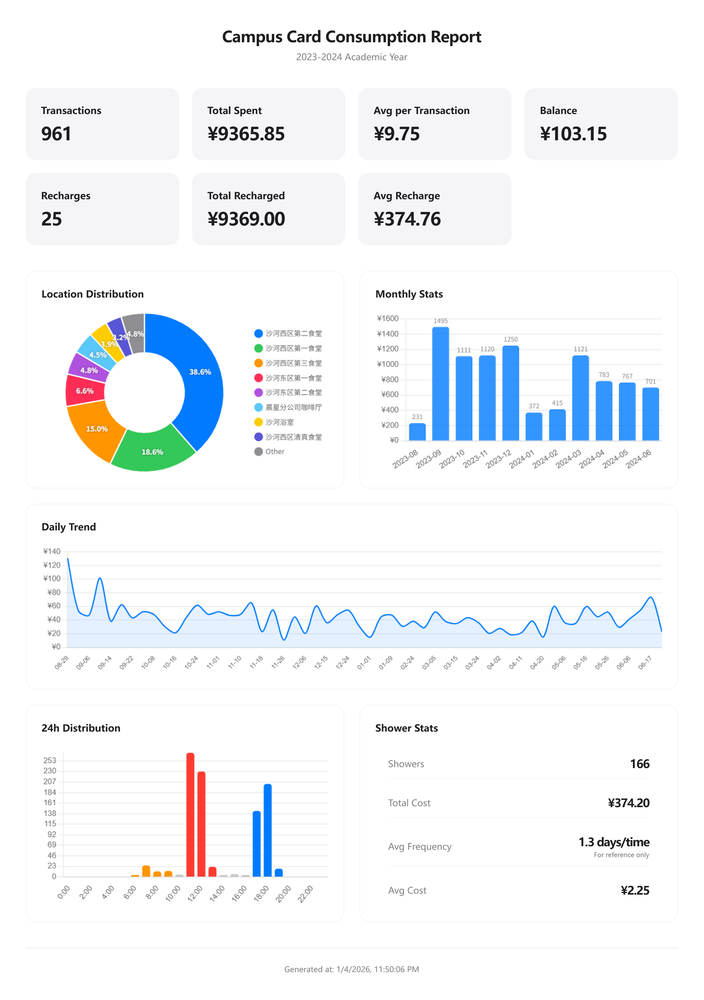

<div align="center">

# MyCampusCard

**A Modern Campus Card Transaction Analyzer**

[English](README.md) | [简体中文](README_zh-CN.md) | [繁體中文](README_zh-TW.md)

[](LICENSE)
[](package.json)
[](#installation)
[](https://www.electronjs.org/)
[](https://vuejs.org/)

</div>

---

## Overview

**MyCampusCard** is a modern, cross-platform desktop application designed for university students to analyze their campus card transaction records. Built with Electron and Vue 3, it provides intuitive data visualization and comprehensive spending analysis while keeping all your data secure and private.

## Features

| Feature | Description |
|---------|-------------|
| **SSO Authentication** | Secure login via university Single Sign-On system |
| **Data Visualization** | Interactive charts powered by Chart.js for spending analysis |
| **One-Click Export** | Generate image reports or export raw transaction data as JSON |
| **Privacy & Security** | All credentials and data processed locally—nothing uploaded to third-party servers |
| **Cross-Platform** | Native support for Windows and macOS |
| **Multi-Language** | Full support for English and Simplified Chinese |

## Screenshot

<div align="center">
  
</div>

## Installation

Download the latest release from [GitHub Releases](https://github.com/wztxy/MyCampusCard/releases) and run it directly—no Node.js required.

### Windows

**Portable executable (.exe)**

1. Download `MyCampusCard-x.y.z.exe` from the release assets
2. Double-click to run
3. If Windows SmartScreen appears, click **More info** → **Run anyway**
4. If flagged by antivirus software, restore from quarantine and add to trusted list

### macOS

**DMG or ZIP archive**

1. Download the macOS asset (`MyCampusCard-x.y.z-*.dmg` or `MyCampusCard-x.y.z-mac.zip`)
2. Drag `MyCampusCard.app` into `/Applications`
3. Open `MyCampusCard`

<details>
<summary><strong>Troubleshooting: "App can't be opened" or "damaged" warning</strong></summary>

This occurs because the app is not Apple-signed/notarized. Choose one of the following solutions:

| Method | Steps |
|--------|-------|
| **A** | Right-click `MyCampusCard.app` → **Open** → **Open** |
| **B** | **System Settings** → **Privacy & Security** → **Open Anyway** |
| **C** | Run the command below in Terminal |

```bash
sudo xattr -dr com.apple.quarantine /Applications/MyCampusCard.app
open /Applications/MyCampusCard.app
```

A helper script is also included in the app bundle:

```
MyCampusCard.app/Contents/Resources/macos/unquarantine.command
```

</details>

## Development

### Prerequisites

- Node.js v18+
- npm or yarn

### Quick Start

```bash
git clone https://github.com/wztxy/MyCampusCard.git
cd MyCampusCard

npm install

npm start
```

### Available Scripts

| Command | Description |
|---------|-------------|
| `npm start` | Build and launch the Electron app |
| `npm run build` | Build the Vue frontend |
| `npm run pack` | Package the app for distribution |
| `npm run typecheck` | Run TypeScript type checking |

## Contributing

Contributions are welcome! Please feel free to submit a Pull Request.

## License

This project is licensed under the [AGPL-3.0](LICENSE) License.

Copyright © 2026 [wztxy](https://github.com/wztxy)

---

<div align="center">

### WhaleU Campus 鲸语校园


A campus forum / treehole developed and operated by students.

Scan to try the WeChat Mini Program!

</div>
