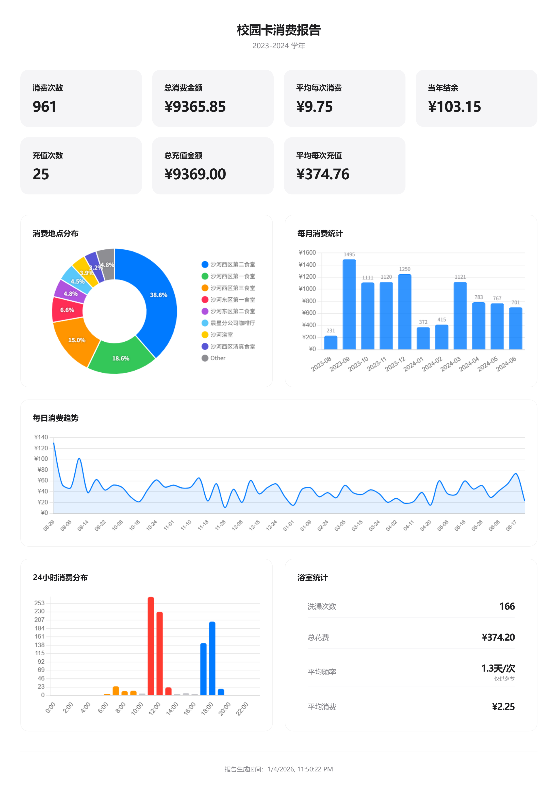

<div align="center">

# MyCampusCard

**现代化校园卡流水分析工具**

[English](README.md) | [简体中文](README_zh-CN.md) | [繁體中文](README_zh-TW.md)

[](LICENSE)
[](package.json)
[](#安装)
[](https://www.electronjs.org/)
[](https://vuejs.org/)

</div>

---

## 项目简介

**MyCampusCard** 是一款现代化、跨平台的校园卡流水分析桌面应用。基于 Electron 和 Vue 3 构建，提供直观的数据可视化和全面的消费分析功能，同时确保您的数据安全与隐私。

## 功能特性

| 功能 | 描述 |
|------|------|
| **SSO 登录** | 通过学校统一身份认证系统安全登录 |
| **数据可视化** | 基于 Chart.js 的交互式图表，直观展示消费分析 |
| **一键导出** | 生成图片报告或导出原始流水 JSON |
| **隐私安全** | 所有凭证和数据仅在本地处理，不上传至第三方服务器 |
| **跨平台支持** | 原生支持 Windows 和 macOS |
| **多语言支持** | 支持简体中文和英文 |

## 效果预览

<div align="center">
  
</div>

## 安装

从 [GitHub Releases](https://github.com/wztxy/MyCampusCard/releases) 下载已构建版本，即可直接运行——无需安装 Node.js。

### Windows

**便携版可执行文件 (.exe)**

1. 从 Release 资产中下载 `MyCampusCard-x.y.z.exe`
2. 双击运行
3. 若出现 Windows SmartScreen 提示，点击 **更多信息** → **仍要运行**
4. 若安全软件误报，请从隔离区恢复并添加至信任区

### macOS

**DMG 或 ZIP 压缩包**

1. 下载 macOS 资产（`MyCampusCard-x.y.z-*.dmg` 或 `MyCampusCard-x.y.z-mac.zip`）
2. 将 `MyCampusCard.app` 拖入 `/Applications`
3. 打开 `MyCampusCard`

<details>
<summary><strong>常见问题：提示"无法打开"或"已损坏"</strong></summary>

由于应用未进行 Apple 签名/公证，macOS 可能会拦截。请选择以下任一方式解决：

| 方式 | 步骤 |
|------|------|
| **A** | 右键 `MyCampusCard.app` → **打开** → **打开** |
| **B** | **系统设置** → **隐私与安全性** → **仍要打开** |
| **C** | 终端执行以下命令 |

```bash
sudo xattr -rd com.apple.quarantine /Applications/MyCampusCard.app
open /Applications/MyCampusCard.app
```

应用包内也附带了辅助脚本：

```
MyCampusCard.app/Contents/Resources/macos/unquarantine.command
```

</details>

## 开发指南

### 环境要求

- Node.js v18+
- npm 或 yarn

### 快速开始

```bash
git clone https://github.com/wztxy/MyCampusCard.git
cd MyCampusCard

npm install

npm start
```

### 可用脚本

| 命令 | 描述 |
|------|------|
| `npm start` | 构建并启动 Electron 应用 |
| `npm run build` | 构建 Vue 前端 |
| `npm run pack` | 打包应用以供分发 |
| `npm run typecheck` | 运行 TypeScript 类型检查 |

## 参与贡献

欢迎贡献代码！请随时提交 Pull Request。

## 许可证

本项目基于 [AGPL-3.0](LICENSE) 许可证开源。

Copyright © 2026 [wztxy](https://github.com/wztxy)

---

<div align="center">

### 鲸语校园


在校生开发和运营的校园论坛 / 树洞

扫码体验微信小程序！

</div>
